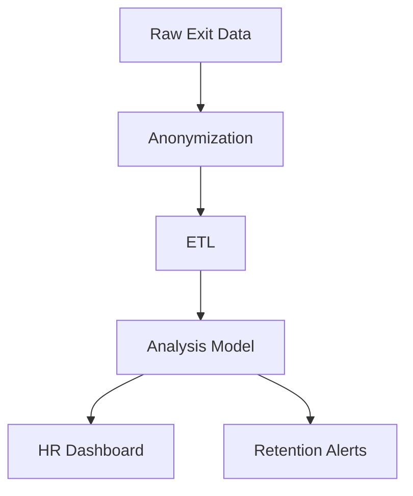

# Operationalization – Cleaning_Analyzing_Employee_Exit_Surveys

## System flow

## Target user, value proposition, deployment

**Target user:** HR. **Value proposition:** Exit analytics – anonymized trends, retention alerts by segment. **Deployment:** HR dashboard; optional scheduled reports and alerts when segments show elevated risk.

## Next steps

1. **run.py:** Load and clean surveys; output key proportions (e.g. dissatisfaction by tenure bucket).
2. **Dashboard:** Segment filters and trend charts.
3. **Alerts:** Threshold-based flags for high-risk segments.
