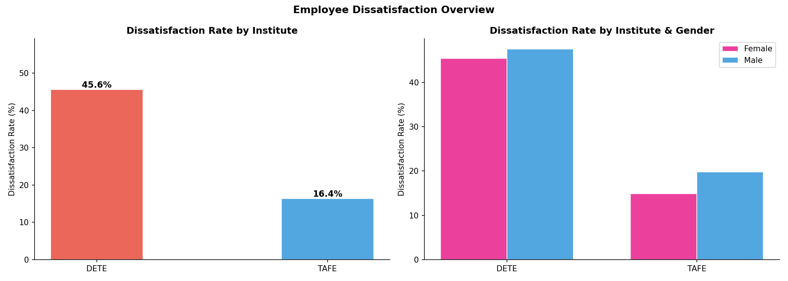
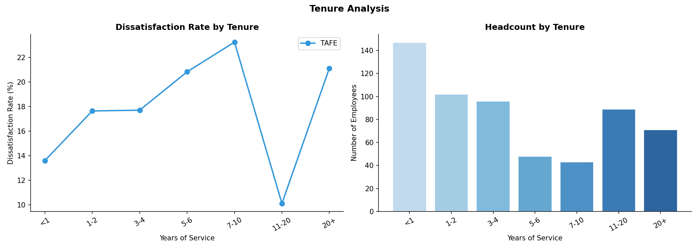
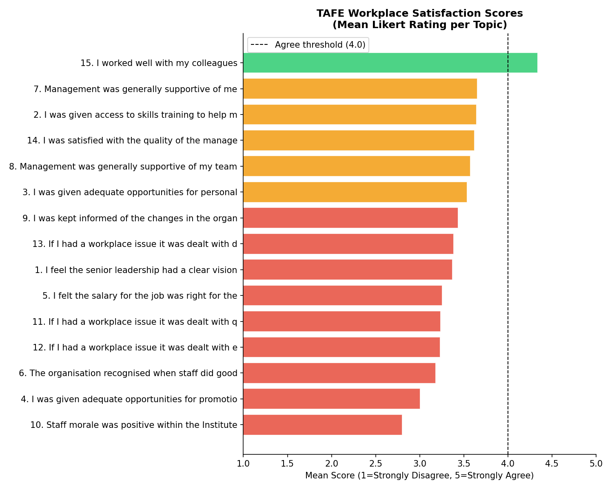
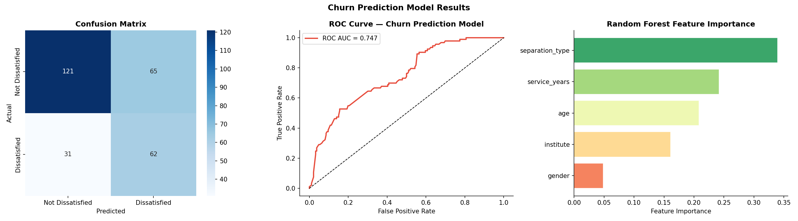

# HR Analytics: Employee Attrition & Dissatisfaction Drivers

**Author:** Ian P. Cox  
**Date:** March 2026  

## 1. Abstract

This report presents a comprehensive HR analytics investigation into employee attrition across two Queensland government bodies: the Department of Education, Training and Employment (DETE) and the Technical and Further Education (TAFE) institute. By harmonizing and analyzing over 1,500 exit surveys, this study identifies the primary drivers of workplace dissatisfaction, maps attrition risk across employee tenure and demographics, and establishes a baseline Random Forest model for predicting dissatisfaction-driven churn.

## 2. Methodology & Data Harmonization

The core challenge of this analysis was harmonizing two distinct survey instruments with differing schemas, taxonomies, and Likert scales. 

* **DETE Survey:** 822 respondents. Dissatisfaction was captured via explicit boolean flags for reasons like "job dissatisfaction", "lack of recognition", and "workload".
* **TAFE Survey:** 702 respondents. Dissatisfaction was captured via a combination of cessation reason flags and a 30-question Likert scale.

**The "Dissatisfied" Flag:** We engineered a unified `dissatisfied` boolean target variable. An employee was marked as dissatisfied if they indicated that any form of workplace friction (management, workload, recognition, physical environment) contributed to their resignation. 

After harmonization, the combined dataset contained 1,524 records, with an overall dissatisfaction rate of 32.2% and a resignation rate of 42.7%.

## 3. Attrition Drivers & Demographics

### 3.1 Institute Comparison
There is a stark contrast in the workplace experience between the two institutes.

DETE employees report a significantly higher rate of dissatisfaction (47.8%) compared to TAFE employees (26.6%). This discrepancy holds true across both male and female cohorts, indicating a systemic organizational difference rather than a demographic artifact.

### 3.2 The "Seven-Year Itch" (Tenure Analysis)
Analyzing dissatisfaction by years of service reveals a distinct non-linear pattern in employee morale.

Dissatisfaction is lowest among new hires (<1 year), likely due to the "honeymoon phase" of a new role. However, dissatisfaction rises steadily, peaking dramatically in the 7-10 year tenure bucket. Employees who survive past the 10-year mark show declining dissatisfaction, suggesting that those who are unhappy leave before a decade of service, while those who remain are the institutional loyalists.

### 3.3 Age Demographics
The age analysis corroborates the tenure findings. Dissatisfaction is lowest among the youngest cohort (Under 21) and peaks in the mid-career demographic (41-50 years old), before tapering off as employees approach retirement age (61+). 

## 4. TAFE Satisfaction Deep-Dive

Because the TAFE survey included a detailed Likert scale (1=Strongly Disagree to 5=Strongly Agree), we can pinpoint the exact operational areas causing friction.

The lowest-scoring metrics universally relate to **management and communication**:
1. *I was kept informed of changes in the organization*
2. *Management was generally supportive of me*
3. *Staff morale was positive within the Institute*

Conversely, the highest-scoring metrics relate to peer relationships:
1. *I worked well with my colleagues*
2. *I was given adequate support by my peers*

This strongly supports the HR adage: *"People don't quit jobs; they quit managers."*

## 5. Churn Prediction Modeling

To move from descriptive to predictive analytics, we trained a Random Forest Classifier to predict whether an exiting employee was leaving due to dissatisfaction, using only their demographic and employment profile (Institute, Gender, Age, Tenure, and Separation Type).

### 5.1 Model Performance
The model achieved a test ROC-AUC of **0.747** (5-Fold CV AUC: 0.688 ± 0.108). 

While predicting human emotion from basic demographics is inherently noisy, the model performs significantly better than random guessing. 

### 5.2 Feature Importance
The Random Forest feature importance extraction confirms the insights from our EDA:
1. **Separation Type:** The strongest predictor. (e.g., Retirees are rarely dissatisfied; resignees often are).
2. **Age & Tenure:** The next most powerful predictors, confirming the "mid-career, mid-tenure" risk zone identified earlier.
3. **Institute:** DETE membership is a strong signal for dissatisfaction.

## 6. Strategic HR Recommendations

Based on the data, HR leadership should focus interventions on the following areas:

1. **Mid-Tenure Intervention:** Implement aggressive retention and "stay interview" programs for employees approaching the 5-7 year mark. This is the critical danger zone for institutional knowledge loss.
2. **DETE Management Audit:** The massive disparity in dissatisfaction between DETE and TAFE warrants a targeted audit of DETE management practices and workload distribution.
3. **Internal Communication:** For TAFE, the lowest-hanging fruit is change management. Improving how organizational changes are communicated to staff will yield the highest ROI for morale.

---
*An interactive version of this analysis is available in the accompanying Plotly Executive Dashboard.*
